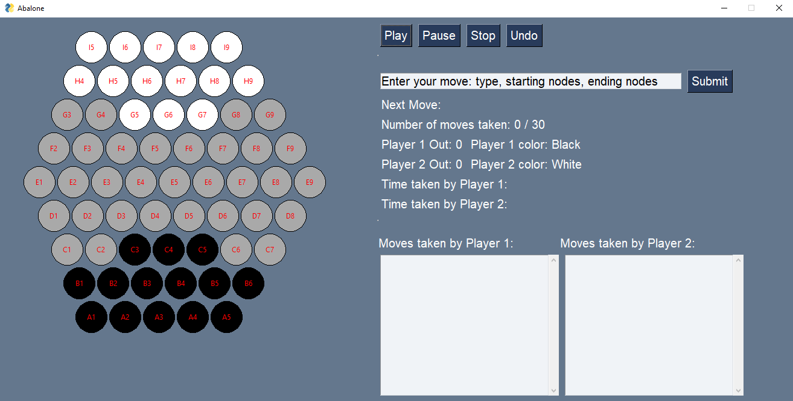

# Abalone AI
This is an AI agent developed by a team of BCIT students for the board game Abalone. The program provides and user interface for users to play against the AI. 

## Table of contents
* [Project Background ](#project-background)
* [Technologies](#technologies)
* [Status](#status)
* [Contact](#contact)

## Project Background 
As part of out Artificial Inteligence course, our end of term project was to create an AI for the board game Abalone. A game that has the goal to push the opponents marbles off the board. [Wikipedia Reference](https://en.wikipedia.org/wiki/Abalone_(board_game)). The goal of this porject was to design a heuristic function for our AI so that it determines the best move in the shortest amount of time. 

## Technologies 
* Python 

## Screenshots 

## Status 
Project is: _finished_

## Contact 
Created by: 
* [@jasonwei0224](www.linkedin.com/in/jasonwei0224) - feel free to contact me!
* [@Vicky Chung](https://www.linkedin.com/in/vickychungg/) 
* [@Louis Lu] 
* [@Pritpal] 
